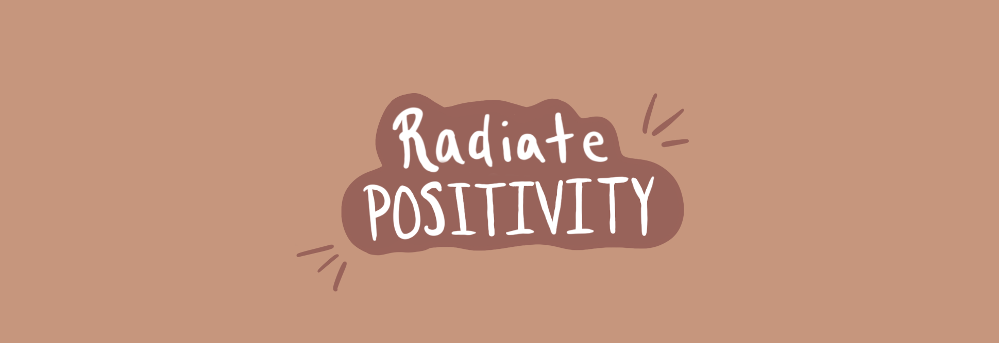

<h1 align='center'> Hi Awesome People 👋 </h1>
<h2 align='center'>I'm Elena, a passionate and curious web developer</h2>
 

🔭 I’m currently a full-time bootcamp student. 

🌱 I’m currently learning everything to become an competitive full-stack developer. 

📫 How to reach me: elenaliu0415@gmail.com

⚡ Fun fact: I am the proud owner of a cute italian greyhound called Luna. 

